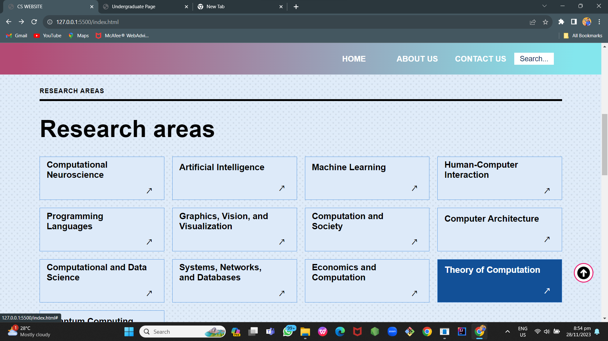

# DCIT_205_IA

# Computer Science Department Website

## Introduction
Welcome to the Computer Science Department's website! This website aims to showcase information about our department's programs, courses, faculty, and events.

## Purpose of the Website
The purpose of this website is to provide a comprehensive platform for students, faculty, and visitors to:
- Explore information about our department's programs and courses.
- Learn about our esteemed faculty members.
- Stay updated with upcoming departmental events and activities.

## Cloning and Setup Instructions
To view or contribute to the website, follow these steps:
1. Clone the repository: `git clone https://github.com/yourusername/computer-science-dept.git`.
2. Navigate to the project directory: `cd computer-science-dept`.
3. Open the `index.html` file in a web browser to view the website.
4. Optionally, modify or extend the website by editing HTML, CSS, or JavaScript files using your preferred code editor.

## Name and Student ID
- **Name**: Franklina Addae
- **Student ID**: 11262526

## Screenshots
### Homepage

### Courses Page

### About Page

### Events Page

### Contact Page

### Research Page

### FAQ Page

### Meetings Page

### Academics Page

### Graduate Page

### Undergraduate Page

## Lessons Learned
During the development of this project, I gained insights into:
- HTML, CSS, and JavaScript for web development.
- Building a responsive and user-friendly website layout.
- Implementing interactive features using JavaScript.
- Organizing and structuring content effectively.
- Troubleshooting and debugging web applications.

This project provided hands-on experience in creating a functional and informative website using fundamental web technologies.

---
*This project README is maintained by Franklina Addae. Feel free to contact me for any queries or suggestions.*
